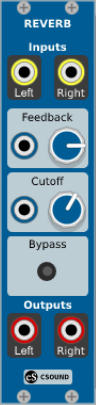
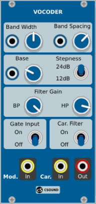
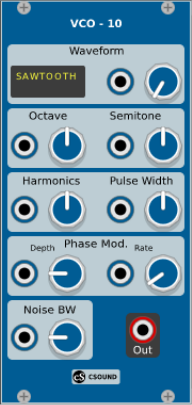
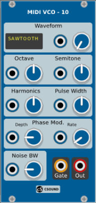
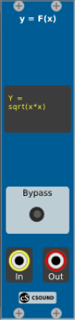

# VCV_Csound
**VCV Rack modules with Csound engine**

Csound is a user-programmable and user-extensible sound processing language and software synthesizer. (www.csound.com)
Csound is copyright (c) 1991 Barry Vercoe, John ffitch, and other contributors.

VCVRack v0.6.1, Csound v6.11 and VCV Rack modules are compiled and tested **ONLY ON LINUX MINT 18.3**.
All modules are **Work in Progress**.

Thanks to:
 - Tutorial plugin 
 - Fundamentals plugins by Andrew Belt http://www.vcvrack.com
 - Csound API at http://csound.com/docs/api/index.html
 - The Csound FLOSS Manual at http://write.flossmanuals.net/csound/preface/
 - The "must have" **Csound realtime examples** by Iain McCurdy at http://iainmccurdy.org/csound.html
 - The "must have" **CSUDO (Csound User Defined Opcodes)** at github.com/csudo/csudo
 - All open sources VCV Rack modules
 - etc...

**Important:**

1) Install the sound and music system Csound, you will found it at www.csound.com.

Csound should be installed in the default location, i.e, includes files should be located in /user/local/include/csound while the Csound library itself should be located in /user/local/lib.

2) Clone from git the VCV_Csound Modules 

   'git clone https://github.com/Djack13/VCV_Csound.git'.

3) Copie the VCV_Csound module directory in /Rack/plugins/

4) Then cd to /Rack/plugins/VCV_Csound and compile with make

All modules use csound scripts, they are located in the directory /VCV_Csound/csd/
These csound scripts are often made by others and modified by me to suit my design.

**Notes for Midi modules (MidiVCO-10, ...):**
- **ONLY ONE Midi module** is allowed in a rack cession.
- Do a module Initialise after a midi device is switched on while the midi module is already loaded. 
- Csound gives illimited polyphony

**List of modules:**

* **Reverb module:**

 

Csound script: Reverb.csd (Iain McCurdy)
The reverbsc opcode is a 8 delay line Feedback Delay Network reverb, with feedback matrix based upon physical modeling scattering junction of 8 lossless waveguides of equal characteristic impedance. (Sean Costello, October 1999)

* **Vocoder module:**

 

Csound script: Vocoder.csd (Iain McCurdy)
This is an implementation of a traditional analogue style vocoder. Two audio signals, referred to as a modulator and a carrier, are passed into the vocoder effect.
The modulator is typically a voice and the carrier is typically a synthesizer.
The modulator is analysed by being passed into a multiband filter (a bank of bandpass filters), the amplitude envelope of each band is tracked and a control function for each band generated.
The carrier signal is also passed through a matching multiband filter, the set of amplitude envelopes derived from the modulator analysis is applied to the outputs of this second multiband filter.

**Carrier Source:**
	External signal used as carrier signal. (sawtooth, square, pulse, noise...).

**Steepness:**
        Steepness of the filters used for both analysis and carrier processing.
	
**Base:**
	Frequency of the lowest filter (both analysis and processing) expressed as a MIDI note number.

**Bandwidth:**
	Bandwidth of the bandpass filters expressed in octaves.

**Spacing:**
	Spacing between the bandpass filters expressed in semitones.

**BPF:**
	Gain of the bank of bandpass filters.

**HPF:**
	Gain of the single highpass filter.

**Gate Input:**
	Activating this switch will apply a noise gate to the modulator signal.
	This option might be useful if the microphone used in rather noisy, such as would be the case if using the built-in microphone on a laptop, or if working in a noisy environment.

* **VCO-10 module:**

 

Csound script: VCO10.csd (Iain McCurdy)

The vco2 opcode models a variety of waveforms based on the integration of band-limited impulses.

* **MidiVCO-10 module:**

 

Csound script: MidiVCO10.csd (Iain McCurdy)
Same module as VCO-10, but is activated by midi notes, polyphony is only limited by hardware.
Gate output is 1 if at least one note is activated, otherwise is 0.

* **Flooper module:**

 

Csound script: Flooper.csd (Joachim Heintz)
Display code is copied from PLAYER module by Clement Foulc
Read wav, aiff, ogg and flac sound files.
**Work in progress.**

* **Y = F(x) module:**

 

Csound script: Yfx.csd

